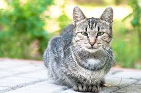
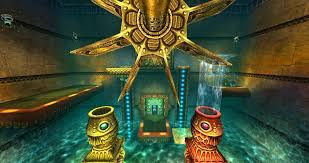

# Info about Matthew Bozoukov

Hi, my name is ** Matthew Bozoukov** and I am a third year cs student at UCSD.

## Experince
I have experince with using

> Python, Java, pytorch, numpy/pandas, docker, and a bunch of other AI related api's
To make a tensor in pytorch of random numbers of size (1,4) you do

'''
new_tensor=torch.randint((1,4))

'''

A project that I am proud of, that was turned into a paper can be found here  [GitHub Pages](github.com/djroytburg/steering_self_preference). and the paper can be found [GitHub Pages](https://arxiv.org/abs/2601.22548).

# Stuff I like to do in my free time

Some things I like to do in my spare time
* Play video games
* Hang out with my family
* work on side projects

## favorite games
My top 3 favorite video games of all time are
1. Legend of Zelda Majoras Mask
2. Super Mario Sunshine
3. League of Legends

## goals
I like to set goals for myself. Here are some goals I have completed in the past, and some that I currently am working towards.
- [x] submitted a paper to a top AI conference
- [x] Transfer to UCSD
- [ ] Graduate from UCSD
- [ ] Get a job I enjoy in AI Safety

[This doc includes some people that have made a big impact on my life](ACKNOWLEDGEMENTS.md)

See [Link Text](#info-about-matthew-bozoukov) for more information about my technical background

